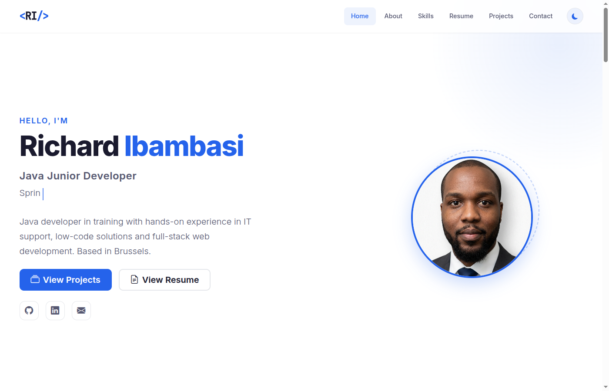
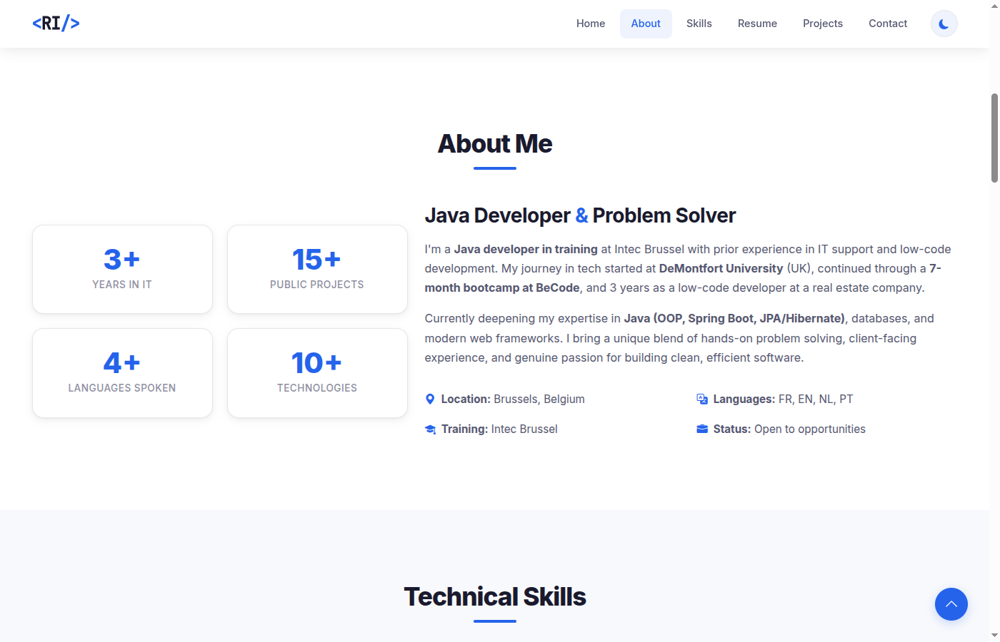
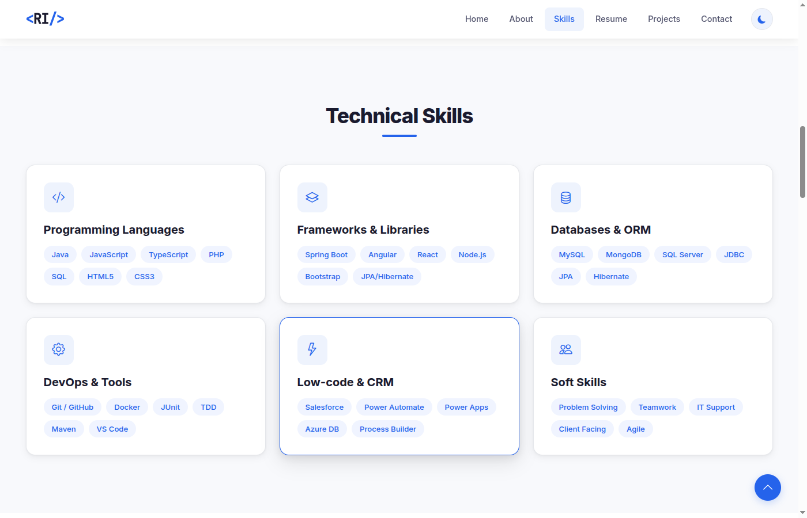
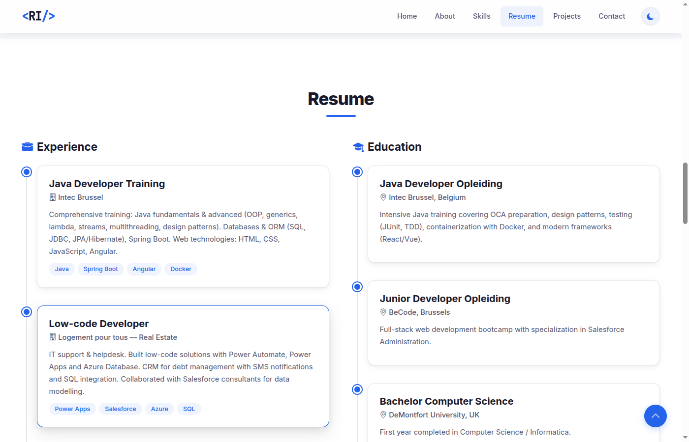
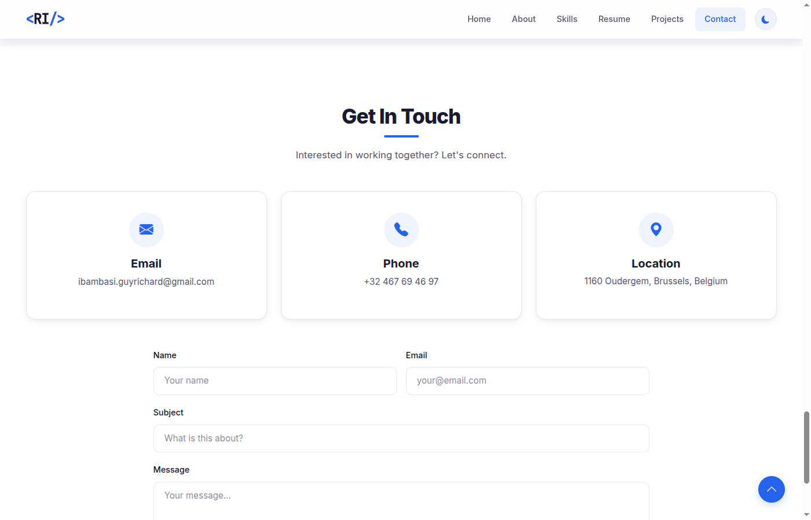
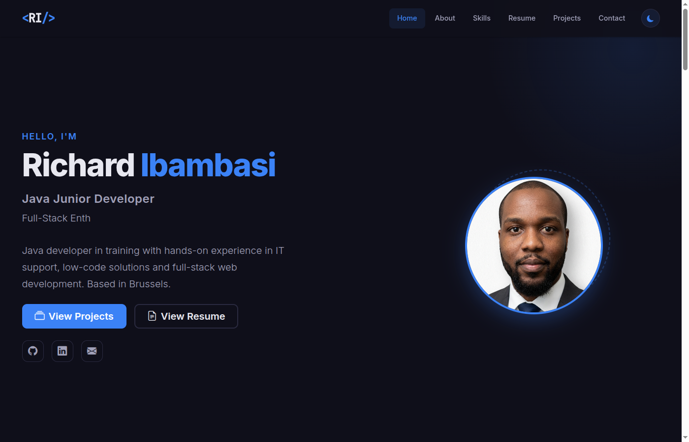
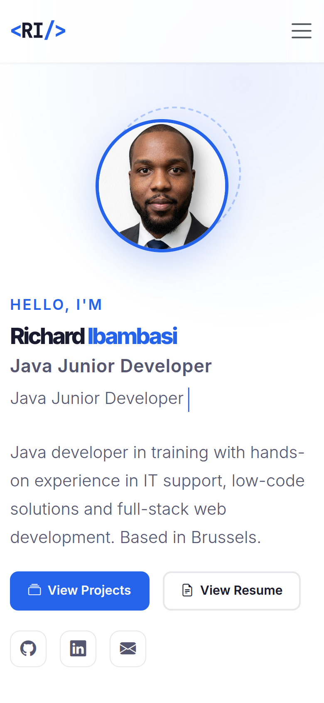

# Richard Ibambasi - Portfolio

[](https://guyrichardib.github.io/)
[](https://developer.mozilla.org/en-US/docs/Web/HTML)
[](https://developer.mozilla.org/en-US/docs/Web/CSS)
[](https://developer.mozilla.org/en-US/docs/Web/JavaScript)
[](https://getbootstrap.com/)

Portfolio professionnel de **Richard Ibambasi**, Java Junior Developer base a Bruxelles. Ce site a ete concu pour presenter mes competences, mon parcours et mes projets dans le domaine du developpement logiciel.

> **Site en ligne :** [https://guyrichardib.github.io/](https://guyrichardib.github.io/)

---

## Apercu du site

### Page d'accueil (Hero)
Section d'accueil avec effet de typing dynamique, photo de profil et liens vers les reseaux sociaux.



### A propos
Presentation personnelle avec des statistiques animees (annees d'experience, projets realises, langues parlees).



### Competences
Grille de competences organisee en 6 categories avec des badges technologiques.



### Parcours (Resume)
Timeline interactive de l'experience professionnelle et de la formation academique.



### Projets
Galerie de projets filtrable par categorie (Java, JavaScript, Web/PHP) avec liens GitHub.


### Contact
Formulaire de contact et informations de contact directes.



### Mode sombre
Le site supporte un theme sombre complet avec persistance via localStorage.



### Vue Mobile (Responsive)
Design responsive adapte a tous les appareils.



---

## Technologies utilisees

### Frontend

| Technologie | Version | Role |
|---|---|---|
| **HTML5** | - | Structure semantique du site |
| **CSS3** | - | Styles personnalises, animations, variables CSS |
| **JavaScript** (Vanilla) | ES6+ | Interactivite, animations, theme toggle |
| **Bootstrap** | 5.3.3 | Framework CSS responsive (grille, composants) |
| **Bootstrap Icons** | 1.11.3 | Bibliotheque d'icones |
| **Google Fonts** | - | Typographies Inter & JetBrains Mono |

### Hebergement & Outils

| Outil | Role |
|---|---|
| **GitHub Pages** | Hebergement statique gratuit |
| **Git / GitHub** | Versionnage et gestion du code source |
| **Formspree** | Backend pour le formulaire de contact |

---

## Structure du projet

```
GuyRichardib.github.io/
├── index.html              # Page principale (SPA)
├── css/
│   └── style.css           # Styles personnalises + themes
├── js/
│   └── main.js             # Logique interactive (10 modules)
├── assets/
│   └── img/
│       └── linkedin.jpeg   # Photo de profil
├── screenshots/            # Captures d'ecran pour le README
│   ├── 01-hero.png
│   ├── 02-about.png
│   ├── 03-skills.png
│   ├── 04-resume.png
│   ├── 05-projects.png
│   ├── 06-contact.png
│   ├── 07-fullpage.png
│   ├── 08-darkmode.png
│   └── 09-mobile.png
└── README.md               # Ce fichier
```

---

## Fonctionnalites

- **Single Page Application (SPA)** - Navigation fluide entre les sections avec smooth scroll
- **Theme sombre / clair** - Toggle avec persistance en localStorage
- **Effet de typing** - Animation de texte dynamique dans la section hero
- **Animations au scroll** - Elements qui apparaissent progressivement (Intersection Observer API)
- **Compteurs animes** - Statistiques qui s'animent a l'apparition
- **Filtrage de projets** - Filtres par categorie avec animation de transition
- **Design responsive** - Adapte a desktop, tablette et mobile
- **Formulaire de contact** - Avec validation et integration Formspree
- **Bouton retour en haut** - Apparait apres 400px de scroll
- **Navigation active** - Detection automatique de la section visible

---

## Ressources externes (CDN)

```html
<!-- Bootstrap 5.3.3 -->
<link href="https://cdn.jsdelivr.net/npm/bootstrap@5.3.3/dist/css/bootstrap.min.css" rel="stylesheet">
<script src="https://cdn.jsdelivr.net/npm/bootstrap@5.3.3/dist/js/bootstrap.bundle.min.js"></script>

<!-- Bootstrap Icons 1.11.3 -->
<link href="https://cdn.jsdelivr.net/npm/bootstrap-icons@1.11.3/font/bootstrap-icons.css" rel="stylesheet">

<!-- Google Fonts -->
<link href="https://fonts.googleapis.com/css2?family=Inter:wght@300;400;500;600;700;800&family=JetBrains+Mono:wght@400;500&display=swap" rel="stylesheet">
```

---

## Installation locale

```bash
# Cloner le depot
git clone https://github.com/GuyRichardib/GuyRichardib.github.io.git

# Ouvrir le dossier
cd GuyRichardib.github.io

# Ouvrir dans le navigateur
open index.html
# ou simplement ouvrir index.html dans votre navigateur
```

> Aucun build tool ou serveur requis. Le site fonctionne directement en ouvrant `index.html`.

---

## Performance et bonnes pratiques

- **Pas de build tools** - HTML/CSS/JS pur, aucune dependance de compilation
- **Passive event listeners** - Optimisation des performances de scroll
- **Intersection Observer API** - Animations performantes au scroll
- **Semantic HTML5** - Balises appropriees (section, nav, main, footer)
- **Accessibilite** - Labels ARIA, textes alternatifs, navigation clavier
- **SEO** - Meta tags descriptifs et structure semantique
- **Optimisation mobile** - Approche mobile-first avec Bootstrap 5

---

## Auteur

**Richard Ibambasi**
- **Email :** ibambasi.guyrichard@gmail.com
- **LinkedIn :** [Richard Ibambasi](https://www.linkedin.com/in/guy-richard-ibambasi-812179139/)
- **GitHub :** [GuyRichardib](https://github.com/GuyRichardib)
- **Localisation :** Bruxelles, Belgique

---

## Licence

Ce projet est un portfolio personnel. Tous droits reserves.
